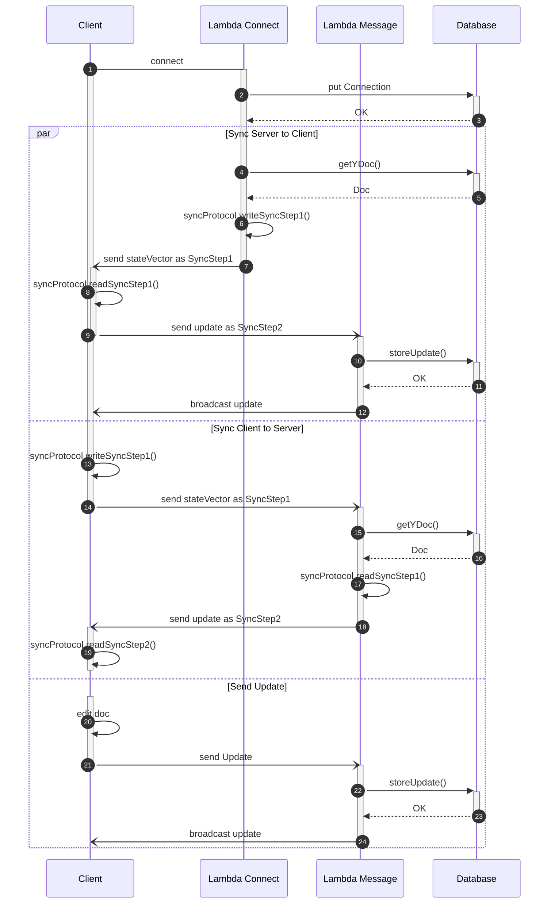

## Sync

```mermaid
sequenceDiagram
  participant C as Client
  participant LC as Lambda Connect
  participant LM as Lambda Message
  participant D as Database

  autonumber

  C -> LC: connect
  activate LC
  activate C
  LC ->> +D: put Connection
  D -->> -LC: OK

  par Sync Server to Client
    LC ->> +D: getYDoc()
    D -->> -LC: Doc
    LC ->> LC: syncProtocol.writeSyncStep1()
    LC -) C: send stateVector as SyncStep1
    deactivate LC
    activate C
    C ->> C: syncProtocol.readSyncStep1()
    C -) LM: send update as SyncStep2
    deactivate C
    activate LM
    LM ->> +D: storeUpdate()
    D -->> -LM: OK
    LM -) C: broadcast update
    deactivate LM

  and Sync Client to Server
    C ->> C: syncProtocol.writeSyncStep1()
    C -) LM: send stateVector as SyncStep1
    deactivate C
    activate LM
    LM ->> +D: getYDoc()
    D -->> -LM: Doc
    LM ->> LM: syncProtocol.readSyncStep1()
    LM -) C: send update as SyncStep2
    deactivate LM
    activate C
    C ->> C: syncProtocol.readSyncStep2()
    deactivate C

  and Send Update
    activate C
    C ->> C: edit doc
    C -) LM: send Update
    deactivate C
    activate LM
    LM ->> +D: storeUpdate()
    D -->> -LM: OK
    LM -) C: broadcast update
    deactivate LM
  end
```
